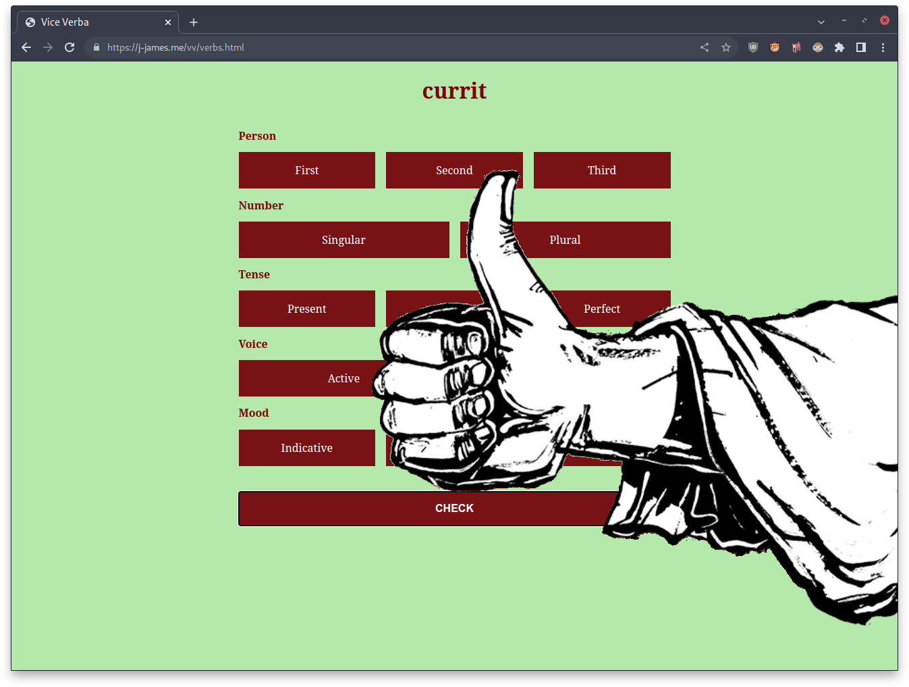

# Vice Verba

This is an implementation of the mobile app [Vice](https://apps.apple.com/us/app/vice-verba/id702387117) [Verba](https://play.google.com/store/apps/details?id=com.ludicroussoftware.viceverba) for the web.

It was written entirely for the purpose of having a way to study verb conjugations and noun declensions easily, and so is exceedingly rough around the edges (esp. as I do not know JavaScript particularly well). Nonetheless, it's public in hopes that someone would find it a useful starting point for learning about event listeners and the DOM.

